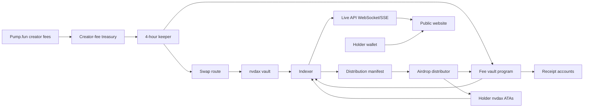

# Architecture

## System Overview

## Fee Source

### Pump.fun Creator Fees

Chosen for this project.

- Creator fees are generated by Pump.fun / PumpSwap trading activity.
- Fees route to the creator or fee-owner wallet configured for the coin.
- The treasury wallet is the canonical source of fee intake receipts.
- Keeper collects/uses available SOL or fee asset balances and converts them into wrapped BTC on Solana.

Tradeoffs:

- Fee rates and mechanics are controlled by Pump.fun contracts and may change.
- Exact fee attribution should be derived from on-chain transactions, not frontend estimates.
- Post-graduation behavior depends on the canonical PumpSwap pool.
- If fees are routed to a normal wallet, custody discipline matters.

### Pump.fun Cashback Mode

Possible alternative if available and appropriate at launch.

- Pump.fun terms describe Cashback Coins where some creator-fee value can be redirected as rewards.
- This may be closer to the desired holder-reward behavior, but it depends on Pump.fun launch settings and smart contract availability.

Tradeoffs:

- Less custom control over nvdax conversion.
- Requires confirming launch-time support and permanence of the setting.
- May not support the exact Jensen Strategy narrative.

### Manual Treasury Deposits

Useful for testing.

- Team deposits SOL/USDC into treasury manually.
- Keeper treats deposits as fee intake.

Tradeoffs:

- Not as credible as direct Pump.fun fee receipts.
- Must be labeled clearly as manual funding.

## Program Responsibilities

The Anchor program should own:

- Global config account.
- Epoch accounts.
- Receipt accounts.
- Distribution manifest registry.
- Airdrop batch registry.
- Optional fallback claim window state.
- Optional fallback Merkle root registry.
- Pause authority.

The program should not own:

- Complex DEX routing logic.
- Native Bitcoin settlement.
- Off-chain holder snapshot calculation.
- Bulk airdrop loops over every holder.

## Keeper Responsibilities

The keeper should:

- Run every 4 hours.
- Detect and collect available Pump.fun creator fees.
- Quote and execute swap route.
- Deposit acquired nvdax into the vault.
- Submit on-chain receipts.
- Trigger batched airdrop distribution after snapshot finalization.
- Alert if slippage, liquidity, or transaction confirmation fails.

Keeper execution can start centralized, but authority should be constrained by:

- Squads multisig where possible.
- Program allowlist.
- Max slippage config.
- Max cycle spend.
- Pausable operations.
- Public transaction receipts.

## Distributor Responsibilities

The distributor should:

- Read finalized distribution manifests.
- Create recipient nvdax associated token accounts when policy allows.
- Send nvdax in bounded batches.
- Record each batch transaction signature.
- Retry failed recipients.
- Produce a failed-recipient list for fallback claims or rollover.

The distributor should never invent allocations. It only executes a signed or hashed manifest produced by the indexer and accepted by the program/admin authority.

## Indexer Responsibilities

The indexer should:

- Watch program accounts and transaction logs.
- Normalize receipt events.
- Track Pump.fun creator-fee treasury inflows.
- Build holder balance history.
- Produce distribution manifests and optional Merkle fallback files.
- Expose dashboard API endpoints.
- Stream live updates through WebSockets or Server-Sent Events.

Recommended storage:

- Postgres for normalized state.
- Object storage for snapshot JSON, manifests, and Merkle fallback files.
- Redis only for cache, not source of truth.

## Live Update Model

The website should not require refreshes. It should subscribe to a live stream from the indexer and update local UI state when events arrive.

Stream event types:

- `fee_intake.detected`
- `swap.confirmed`
- `epoch.created`
- `snapshot.updated`
- `manifest.finalized`
- `airdrop_batch.sent`
- `airdrop_transfer.failed`
- `holder_estimate.updated`

Use Solana RPC subscriptions for low-level account/log changes where useful, but normalize them through the indexer before rendering. The browser should consume stable project events, not raw transaction logs.

## Privy Fit

Privy can handle embedded Solana wallets for holder onboarding and can also manage server-controlled wallets. For production custody, prefer a multisig or program-controlled vault for significant funds, with Privy used for operational signing where appropriate.

The safer custody split is:

- Treasury fee-owner wallet: Privy-controlled or multisig.
- Keeper hot wallet: limited balance, can swap and submit receipts.
- Distributor wallet: limited nvdax funding per batch.
- nvdax vault: multisig or program-owned token account.
